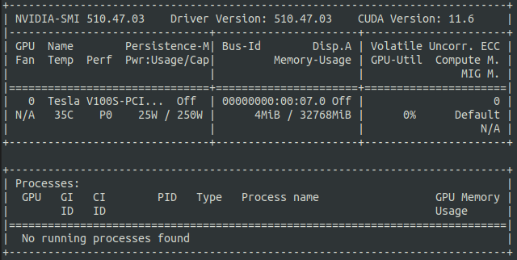
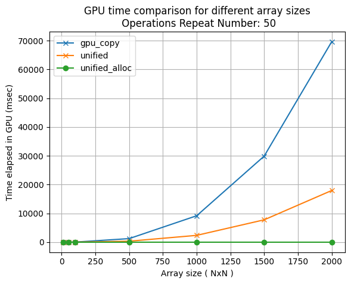
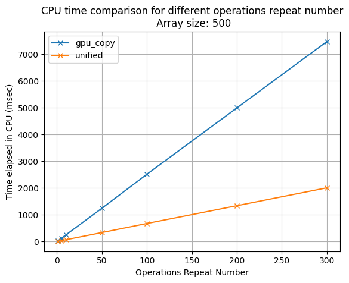
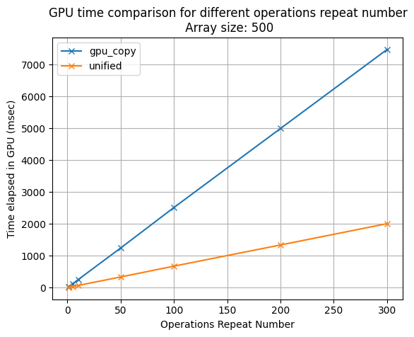

# Memory Benchmarks for Cupy

### Test CPU - GPU copies vs cupy's unified memory

## Python Files

- implementations.py
: contains **gpu_copy** and **unified** &nbsp; functions
    - **gpu_copy**
    : memory copies between CPU - GPU
    - **unified**
    : use of cuda unified memory ( by using unified_{pointers, arrays} functions ) 
  
  <br>

- timers.py
: contains helper function to time given function and returt result and stats

<br>

- test.py
: manually test function from implementations.py with below parameters
    - size: Array size (NxN) used for testing (default=10)
    - repeat: Benchmark repetition times (default=10)
    - num_oper: Perform #num_oper operation loops (default=10)
    - gpu_copy: use of **gpu_copy** function
    - unified: use of **unified** function

<br>

-   bench.py
: Bench the above-mentioned functions and plot results

## Results

GPU specs used for experiment with bench.py: <br>
```
nvidia-smi
 ```
 

<br>

 ### Benchmark for different array sizes

<p float="middle">
  
   
</p>

<br>

 ### Benchmark for different number of operations loops

<p float="middle">
  
   
</p>